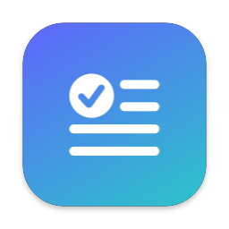

<p align="center">
  
</p>

<h1 align="center">Lexa</h1>

<p align="center">
  A small Grammarly alternative for macOS.<br>
  Use a free LLM, a local model, or your ChatGPT or Claude subscription.
</p>

<p align="center">
  <a href="https://github.com/SASUKE40/Lexa/releases/latest"></a>
</p>

<p align="center">
  <a href="https://github.com/SASUKE40/Lexa/releases/latest"></a>
  
  <a href="LICENSE"></a>
</p>

https://github.com/user-attachments/assets/a1467c7b-f5d9-444c-9aac-b6fd7a29da73

<sub>The model results in the video are examples from a local test server.</sub>

## Installation

You must have macOS 26 (or a newer version).

```sh
brew install --cask sasuke40/tap/lexa
```

You can also download `Lexa-x.y.z.zip` from the [latest release](https://github.com/SASUKE40/Lexa/releases/latest). Move `Lexa.app` to the Applications folder.

Apple did not notarize Lexa. When you open Lexa for the first time, go to **System Settings → Privacy & Security**. Then click **Open Anyway**. Lexa must have **Accessibility** access to copy and paste the text.

## Procedure

1. Select text in an app.
2. Press **⌥⌘G**.
3. Look at the highlighted changes.
4. Press **↩** to replace the selected text.

| Key | Action |
|---|---|
| ⌘1 | **Correct**: correct the grammar, spelling, and punctuation |
| ⌘2 | **Make Clear**: write the text again in [ASD-STE100 Simplified Technical English](https://www.asd-ste100.org) |
| — | **Tone**: change the text to a Formal, Friendly, Short, or Confident tone |
| — | **Translate**: translate the text into one of 15 languages |
| ⌘C / ⌘R / Esc | Copy the result / try again / close the popup window |

To change the shortcut or the default action, click the menu bar icon. Then click **Settings…**.

## Providers

| Provider | Access |
|---|---|
| OpenRouter | **Sign in with OpenRouter**, or an API key |
| Nous Portal | **Sign in with Nous Portal**, or an API key |
| GitHub Models | **Sign in with GitHub**, the GitHub CLI login, or a token |
| Groq, Cerebras, Google Gemini, Mistral | A free API key |
| Ollama, LM Studio | Local. A key is not necessary. |
| ChatGPT, Claude | Your subscription, through the `codex` or `claude` CLI |
| Custom | A server with an OpenAI-compatible `/chat/completions` endpoint |

Lexa keeps API keys and tokens in the macOS Keychain. Lexa does not read the credentials of the `codex` and `claude` CLIs. Use your subscription only for your work, and obey the terms of your plan.

The Nous Portal sign-in uses the public client ID of Hermes Agent. Nous Research did not give Lexa permission for this sign-in, and it can stop at any time.

## Updates

Lexa looks for a new release when it starts and one time each day. To install an update, click **Install the Update** in **Settings → General**. If you installed Lexa with Homebrew, type `brew upgrade --cask lexa`.

## Privacy

Lexa sends your text only to the provider that you select. With Ollama or LM Studio, your text stays on your Mac.

## Development

```sh
make signing # Do one time
make run     # Build and start Lexa
make test    # Do the tests
```

For more information, refer to [docs/DEVELOPMENT.md](docs/DEVELOPMENT.md).

## License

[MIT](LICENSE)
